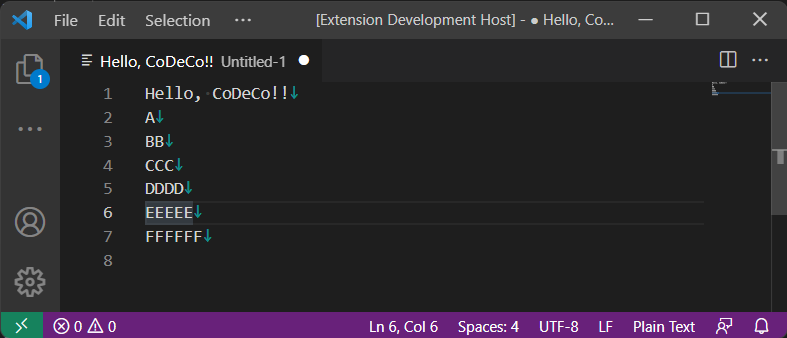
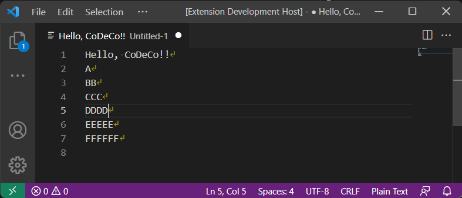
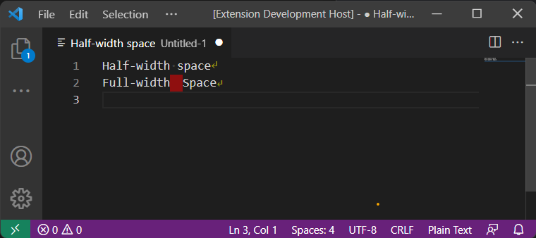

# CoDeCo

CoDeCo is a code decorator extenstion for Visual Studio Code.  
This extension provides the following features.

* Display EOL (new line) characters.
* Display Full-width Space.

## Example

### Display EOL (End Of Line) characters.

#### LF

#### CR+LF

### Display Full-width Space.

## Thanks

### decorator-sample

https://github.com/microsoft/vscode-extension-samples/tree/main/decorator-sample

### code-eol

https://github.com/sohamkamani/code-eol

## License

Distributed under the MIT License. See [LICENSE](./LICENSE) for more information.
